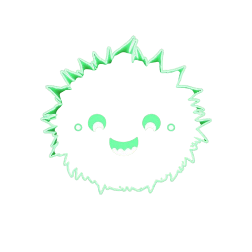

<p align="center">
  
</p>
<p align="center">
  
</p>

# Unsloth UI

A modular and user-friendly interface for fine-tuning, exporting, and using Unsloth-powered language models.

<p align="center">
  
</p>

## Features

- **Fine-tune Models**: Train custom models with LoRA adapters on any dataset
- **Merge Base Models and Adapters**: Create standalone models with integrated LoRA adapters
- **Export to GGUF**: Automatically convert to GGUF format with various quantization options
- **Ollama Integration**: Create, test, and run models in Ollama
- **Environment-Aware**: Automatically organizes model files in a structured directory

## Installation

1. Clone this repository:
   ```bash
   git clone https://github.com/yourusername/unsloth-ui.git
   cd unsloth-ui
   ```

2. Install the required packages:
   ```bash
   pip install unsloth gradio transformers datasets huggingface_hub torch trl
   ```

3. Install Ollama (optional, for Ollama integration):
   - Visit [ollama.com](https://ollama.com) for installation instructions

## Directory Structure

```
unsloth_ui/
├── run.py                  # Main entry point to run the application
├── main.py                 # Gradio UI code and interface
├── config.py               # Environment variables, constants, and settings
├── utils.py                # Core model fine-tuning and dataset functions
├── gguf_utils.py           # GGUF conversion and export utilities
├── ollama_utils.py         # Ollama integration and model deployment
├── convert_to_gguf.bat     # Windows batch script for llama.cpp conversion
├── unslothSticker.png      # Logo image (optional)
└── README.md               # Project documentation
```

## Organized Model Storage

The application uses the `UNSLOTH_FINETUNED_MODELS` environment variable to determine where models and related files are stored. The default is `~/unsloth_models`, but you can customize it. The structure created is:

```
$UNSLOTH_FINETUNED_MODELS/
├── base_models/            # Downloaded base models
├── datasets/               # Training datasets
├── finetuned/              # Fine-tuned models with LoRA adapters
├── merged/                 # Merged models (base + adapter)
├── gguf/                   # GGUF exports
└── ollama/                 # Ollama modelfiles and configurations
```

## Usage

### Setting Up Environment (Optional)

```bash
# Windows
set UNSLOTH_FINETUNED_MODELS=D:\path\to\models

# Linux/macOS
export UNSLOTH_FINETUNED_MODELS=/path/to/models
```

### Running the Application

```bash
python run.py
```

This will start the Gradio interface, accessible at http://localhost:7860 by default.

## Fine-Tuning Workflow

1. **Select Model and Dataset**:
   - Choose a base model from the dropdown
   - Select a dataset or enter a custom dataset name

2. **Configure Training Parameters**:
   - Adjust sequence length, LoRA rank, learning rate, batch size, etc.
   - Set epochs or max steps

3. **Set Output Options**:
   - Choose output directory
   - Enable model merging if desired
   - Configure Hugging Face push options
   - Enable auto-export to GGUF if needed

4. **Start Training**:
   - Click "Start Fine-Tuning"
   - Monitor progress in the output area

## Testing Your Model

1. Go to the "Inference" tab
2. Enter the path to your fine-tuned model
3. Write a prompt
4. Adjust generation parameters
5. Click "Run Inference"

## GGUF Export

1. Go to the "Export to GGUF" tab
2. Select the model to export
3. Choose quantization methods (q4_k_m, q5_k_m, q8_0, f16)
4. Configure output options
5. Click "Export to GGUF"

## Ollama Integration

### Creating an Ollama Model

1. Go to the "Ollama Integration" tab
2. Click "Scan for GGUF Files" to find available models
3. Select a GGUF file
4. Configure model parameters (name, system prompt, template, etc.)
5. Click "Create & Import to Ollama"

### Testing an Ollama Model

1. Go to the "Export to GGUF" tab, scroll to "Test with Ollama"
2. Enter the model name
3. Write a test prompt
4. Click "Test with Ollama"

## Customization

### Adding Custom Models

1. Add new models to the `MODELS` list in `config.py`
2. Restart the application

### Adding Custom Datasets

1. Add new datasets to the `COMMON_DATASETS` list in `config.py`
2. Restart the application

### Customizing Templates

1. Modify the templates in `gguf_utils.py` or `ollama_utils.py`
2. Restart the application

## Advanced Usage

### Dual Repository Upload

You can push both LoRA adapters and merged models to separate Hugging Face repositories:

1. Enable "Push to Hugging Face Hub"
2. Enable "Merge LoRA with base model"
3. Enable "Use Separate Repositories for LoRA and Merged Model"
4. Enter repository IDs for both

### Custom GGUF Conversion

For manual GGUF conversion using llama.cpp:

1. Clone llama.cpp repository if not already available
2. Use the built-in conversion functions in `gguf_utils.py`
3. Or use the included batch script on Windows

## Troubleshooting

- **Missing GGUF Files**: Use the "Scan for GGUF Files" button to locate GGUF files in common directories
- **Ollama Server Not Running**: Use the "Start Ollama Server" button to start the server
- **Training Errors**: Check the detailed logs in the output area for error messages
- **Import Errors**: Make sure all required packages are installed

## Contributing

1. Fork the repository
2. Create a feature branch
3. Make your changes
4. Submit a pull request

## License

This project is open source and available under the MIT License.
